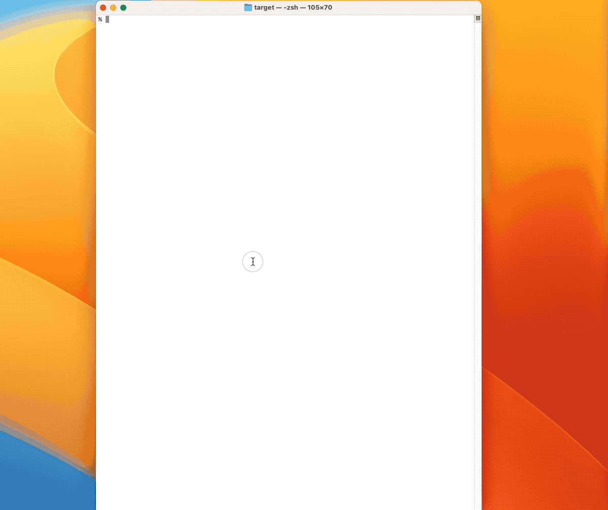
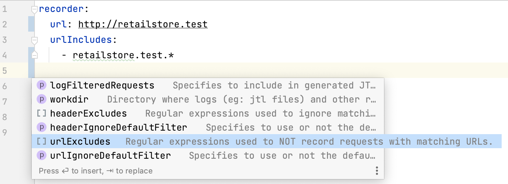

## DSL recorder

When creating test plans you can rely just on the IDE or you can use provided recorder. 

Here is a small demo using it:



::: tip
You can use [jbang](https://www.jbang.dev/documentation/guide/latest/index.html) to easily execute the recorder with the latest version available. E.g.:

```bash
jbang us.abstracta.jmeter:jmeter-java-dsl-cli:1.10 recorder http://retailstore.test
```
:::

::: tip
Use `java -jar jmdsl.jar recorder --help` to see the list of options to customize your recording.
:::

::: tip
In general use `---url-includes` to ignore URLs that are not relevant to the performance test.
:::

### Correlations

To avoid fragile test plans with fixed values in request parameters, the DSL recorder, through the usage of the [JMeter Correlation Recorder Plugin](https://github.com/Blazemeter/CorrelationRecorder), allows you to define correlation rules.

Correlation rules define regular expressions, which allow the recorder to automatically add `regexExtractor` and replace occurrences of extracted values in following requests with proper variable references.

For example, for the same scenario previously shown, and using `--config` option (which makes correlation rules easier to maintain) with following file:

```yaml
recorder:
  url: http://retailstore.test
  urlIncludes:
    - retailstore.test.*
  correlations:
    - variable: productId
      extractor: name="productId" value="([^"]+)"
      replacement: productId=(.*)
```

We get this test plan:

```java
///usr/bin/env jbang "$0" "$@" ; exit $?
/*
These commented lines make the class executable if you have jbang installed by making the file
executable (eg: chmod +x ./PerformanceTest.java) and just executing it with ./PerformanceTest.java
*/
//DEPS org.assertj:assertj-core:3.23.1
//DEPS org.junit.jupiter:junit-jupiter-engine:5.9.1
//DEPS org.junit.platform:junit-platform-launcher:1.9.1
//DEPS us.abstracta.jmeter:jmeter-java-dsl:1.10

import static org.assertj.core.api.Assertions.assertThat;
import static us.abstracta.jmeter.javadsl.JmeterDsl.*;

import java.io.IOException;
import java.io.PrintWriter;
import java.nio.charset.StandardCharsets;
import org.apache.http.entity.ContentType;
import org.apache.jmeter.protocol.http.util.HTTPConstants;
import org.junit.jupiter.api.Test;
import org.junit.platform.engine.discovery.DiscoverySelectors;
import org.junit.platform.launcher.core.LauncherDiscoveryRequestBuilder;
import org.junit.platform.launcher.core.LauncherFactory;
import org.junit.platform.launcher.listeners.SummaryGeneratingListener;
import org.junit.platform.launcher.listeners.TestExecutionSummary;
import us.abstracta.jmeter.javadsl.core.TestPlanStats;

public class PerformanceTest {

  @Test
  public void test() throws IOException {
    TestPlanStats stats = testPlan(
        threadGroup(1, 1,
          httpDefaults()
            .encoding(StandardCharsets.UTF_8),
          httpSampler("/-1", "http://retailstore.test"),
          httpSampler("/home-3", "http://retailstore.test/home")
            .children(
              regexExtractor("productId#2", "name=\"productId\" value=\"([^\"]+)\"")
                .defaultValue("productId#2_NOT_FOUND")
            ),
          httpSampler("/cart-16", "http://retailstore.test/cart")
            .method(HTTPConstants.POST)
            .contentType(ContentType.APPLICATION_FORM_URLENCODED)
            .rawParam("productId", "${productId#2}"),
          httpSampler("/cart-17", "http://retailstore.test/cart")
        )
    ).run();
    assertThat(stats.overall().errorsCount()).isEqualTo(0);
  }

  /*
   This method is only included to make the test class self-executable. You can remove it when
   executing tests with maven, gradle, or some other tool.
   */
  public static void main(String[] args) {
    SummaryGeneratingListener summaryListener = new SummaryGeneratingListener();
    LauncherFactory.create()
        .execute(LauncherDiscoveryRequestBuilder.request()
                .selectors(DiscoverySelectors.selectClass(PerformanceTest.class))
                .build(),
            summaryListener);
    TestExecutionSummary summary = summaryListener.getSummary();
    summary.printFailuresTo(new PrintWriter(System.err));
    System.exit(summary.getTotalFailureCount() > 0 ? 1 : 0);
  }

}
```

In this test plan you can see an already added an extractor and the usage of extracted value in a subsequent request (as a variable reference).

::: tip
To identify potential correlations, you can check in request parameters or URLs with fixed values and then, check the automatically created recording `.jtl` file (by default in `target/recording` folder) to identify proper regular expression for extraction. 

We have ideas to ease this for the future, but, if you have ideas, or just want to give more priority to improving this, please create an [issue in the repository](https://github.com/abstracta/jmeter-java-dsl/issues) to let us know.
:::

::: tip
When using `--config`, take advantage of your IDEs auto-completion and inline documentation capabilities by using `.jmdsl.yml` suffix in config file names.

Here is a screenshot of autocompletion in action:


:::